# Movie Memoir - Android  Application 

### Sign In Screen

 
 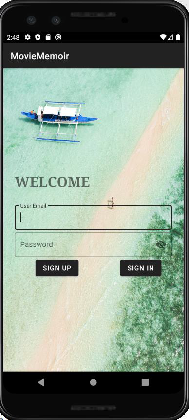   

### Sign Up Screen 

 
  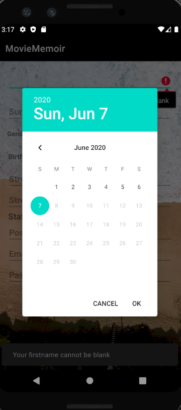  
 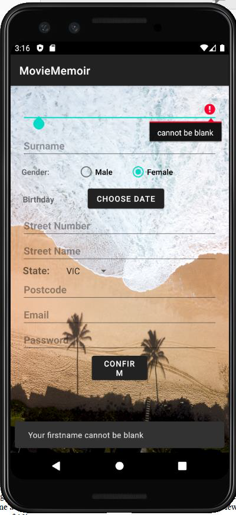 

### Home Screen 

 
 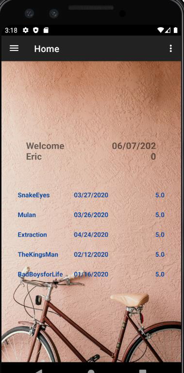   

### Sidebar

 
 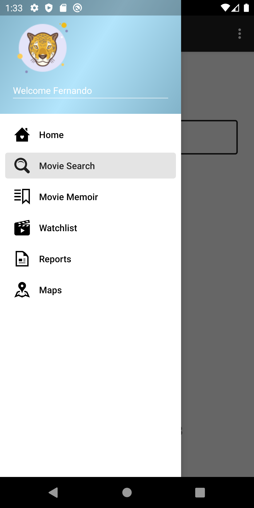   

### Movie View

 
 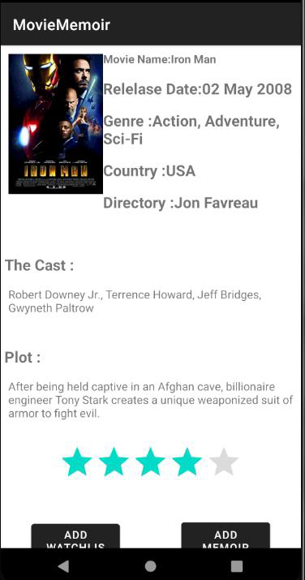   

### Watch List Screen

 
 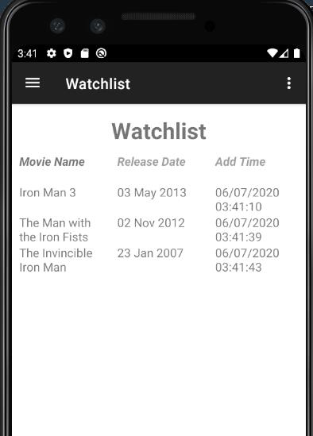   
 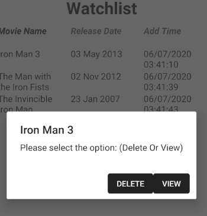  

### Add Movie Screen

 
 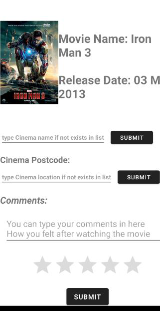   
 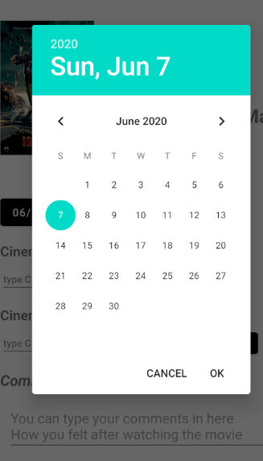  

### Movie Memoir 

 
 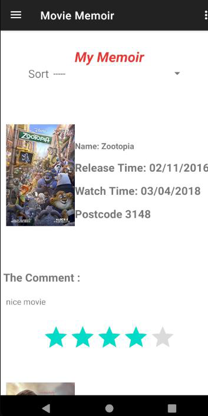   

### Map

 
  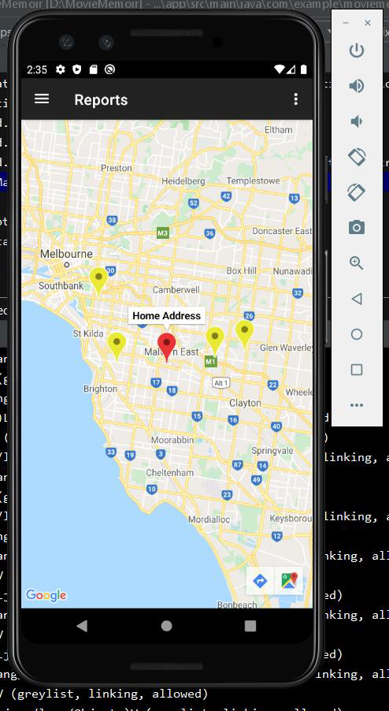  
 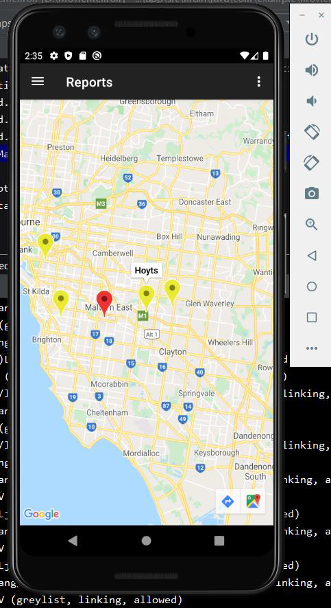 

